  

  

  

  
  
  
  

### Arsenal

   
  
  
  

### Training Log

  

  
  
  

  <picture>
    <source media="(prefers-color-scheme: dark)" srcset="https://raw.githubusercontent.com/rusianx/rusianx/output/snake-dark.svg" />
    
  </picture>

  
Random dev joke

  

  

